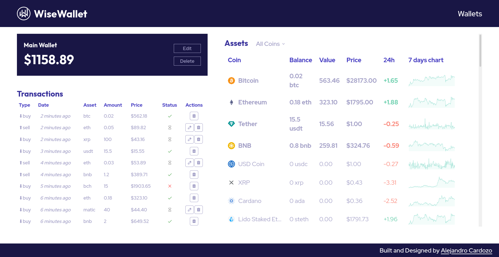

  <!-- <a href="https://guita.vercel.app/" rel="noopener"> -->
    
  <!-- </a> -->

<h3 align="center">WiseWallet</h3>

---

 The Easiest Way to Buy and Sell Crypto!
      

## Table of Contents

- [About](#about)
- [Getting Started](#getting_started)
- [Deployment](#deployment)
- [Usage](#usage)
- [Built Using](#built_using)
- [Authors](#authors)

## About 

This is a prototype of a virtual cryptocurrency wallet.

## Getting Started 

These instructions will get you a copy of the project up and running on your local machine for development and testing purposes. See [deployment](#deployment) for notes on how to deploy the project on a live system.

### Prerequisites

- You will need to have [Nodejs](https://nodejs.org/en/) in your system. Check the [official documentation](https://nodejs.org/en/docs) to install it.

### Installing

Once you have Node Js on your system, clone the repository and perform the following command line actions:

1. Use `cd WiseWallet` to access the project folder.
2. Run `npm install` in order to get all the dependencies needed.
3. Run `npm run dev` for running the project locally.

Once the steps outlined above are complete, the project should be running on [port 5173](http://localhost:5173/)

## Usage 

</a>

This is a list of the actions you can currently perform on the virtual wallet:
- Create, delete and modify wallets
- View a list of all created wallets
- View a list of all currencies available for purchase/sale
- Add cryptocurrency sale transactions to a wallet
- Add cryptocurrency purchase transactions to a wallet
- Update transactions from a wallet
- Approve or cancel transactions from a wallet
- View the transaction history of a wallet

## Deployment 

You can deploy this page to any development platform with serverless backend services like [Vercel](https://vercel.com/) or [Netlify](https://www.netlify.com/). Please refer to the chosen service's docs for more details on implementation.

## Built Using 

- [React](https://reactjs.org/) - A JavaScript library for building user interfaces
- [Vite](https://sass-lang.com/) - Next Generation Frontend Tooling
- [Redux](https://redux.js.org/) - A Predictable State Container for JS Apps
- [React Router](https://reactrouter.com/en/main) - Client Side Routing Library

## ✍️ Authors 

- [@alejandrocardozo](https://github.com/Alejandro-Cardozo) - Build and Design by
